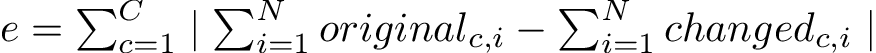

# Configurazione iniziale

Il sistema è pensato per funzionare su MySQL/MariaDB.

I dati per la connessione vanno impostati nel file config.py nella root di questo repository.
Un esempio di configurazione è presente in [config.py.sample](config.py.sample)

# Test

Il calcolo dell'errore, su una tabella contenente C campi il cui tipo è
cambiato ed N righe, usa la formula .
